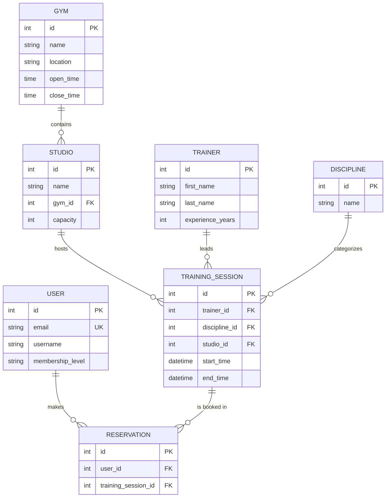

# Gym API

A RESTful API for a gym / fitness‑studio booking system, built with Django REST Framework.
Members can browse gyms, studios, trainers, disciplines and scheduled training sessions, and
reserve a spot in a session online — without visiting the gym in person.


## Features

- **JWT authentication** (access + refresh tokens) plus session auth for the browsable API
- **Custom user model** with email login and a membership level (basic / standard / premium)
- **Role‑based access** — anyone can read the catalogue, only admins can modify it (`IsAdminOrReadOnly`)
- **Online reservations** with validation:
  - a full session (studio capacity reached) is rejected
  - the same user cannot book the same session twice — enforced in the serializer **and** by a
    database `UniqueConstraint`
  - a session that has already started cannot be booked
- **`available_places`** shown per session (capacity − reservations)
- **Filtering** of training sessions by `?discipline=<id>` and `?date=YYYY-MM-DD`
- **Custom endpoint** listing all sessions of a given trainer
- Deterministic **pagination** and request **throttling**
- Django **admin** for managing every entity

## Tech stack

- Python 3.14
- Django 6 · Django REST Framework
- djangorestframework‑simplejwt (JWT)
- SQLite (development)

## Database schema



## Getting started

### 1. Clone the repo
```bash
git clone https://github.com/Darmi555/gym-api.git
cd gym-api
```

### 2. Create and activate a virtual environment
```bash
python -m venv venv

# Windows (PowerShell)
venv\Scripts\activate

# macOS / Linux
source venv/bin/activate
```

### 3. Install dependencies
```bash
pip install -r requirements.txt
```

### 4. Configure environment variables
Copy the sample file and fill it in:
```bash
# Windows (PowerShell)
Copy-Item .env.sample .env

# macOS / Linux
cp .env.sample .env
```
Generate a fresh `SECRET_KEY` and paste it into `.env`:
```bash
python -c "from django.core.management.utils import get_random_secret_key; print(get_random_secret_key())"
```

`.env` variables:

| Variable | Example | Meaning |
|----------|---------|---------|
| `SECRET_KEY` | `k3y...` | Django secret key (keep private) |
| `DEBUG` | `True` | Debug mode; use `False` in production |
| `ALLOWED_HOSTS` | `127.0.0.1,localhost` | Comma‑separated allowed hosts |

### 5. Apply migrations and create an admin
```bash
python manage.py migrate
python manage.py createsuperuser
```

### 6. Run the development server
```bash
python manage.py runserver
```

## Authentication

The API uses JWT. Typical flow:

1. **Register:** `POST /api/gym/users/` with `email`, `username`, `password`.
2. **Get a token:** `POST /api/token/` with `email` and `password` → returns `access` and `refresh`.
3. **Call the API:** send the header `Authorization: Bearer <access>`.
4. **Refresh:** `POST /api/token/refresh/` with the `refresh` token to get a new `access`.

For the browsable API you can also log in with a session at `/api-auth/login/`.

## API endpoints

Base path: `/api/gym/`

| Method | Endpoint | Access | Description |
|--------|----------|--------|-------------|
| `POST` | `/users/` | public | Register a new user |
| `GET` `PUT` `PATCH` | `/users/{id}/` | authenticated | Manage own profile (admin sees all) |
| `GET` | `/gyms/` `/gyms/{id}/` | read: public · write: admin | Gyms |
| `GET` | `/studios/` `/studios/{id}/` | read: public · write: admin | Studios |
| `GET` | `/trainers/` `/trainers/{id}/` | read: public · write: admin | Trainers |
| `GET` | `/trainers/{id}/sessions/` | public | All sessions led by that trainer |
| `GET` | `/disciplines/` | read: public · write: admin | Disciplines |
| `GET` | `/training-sessions/` | read: public · write: admin | Sessions; filter `?discipline=` & `?date=` |
| `GET` `POST` | `/reservations/` | authenticated | Your reservations / book a session |
| `POST` | `/api/token/` | public | Obtain a JWT (access + refresh) |
| `POST` | `/api/token/refresh/` | public | Refresh the access token |

## Running the tests

```bash
python manage.py test
```

## Screenshots

_Browsable API screenshots — to be added._
